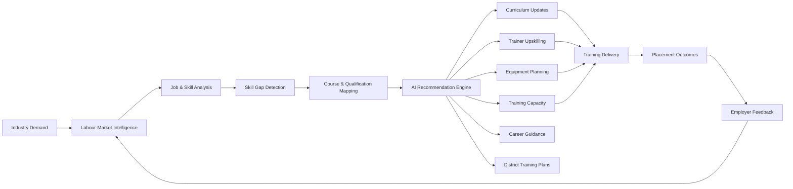

<div align="center">

# 🎯  Labour-Market Intelligence & Curriculum Alignment Platform

### **From Labour-Market Signals → Skills → Curriculum → Training → Employment**

<p>
  
  
  
  
</p>

<p>
  A data-driven platform that connects <strong>industry demand</strong> with
  <strong>skills, qualifications, curricula, training capacity, trainers, infrastructure, and candidate career pathways.</strong>
</p>

<br>

<a href="#-problem-statement">Problem</a> •
<a href="#-our-solution">Solution</a> •
<a href="#-features">Features</a> •
<a href="#-architecture">Architecture</a> •
<a href="#-dashboards">Dashboards</a> •
<a href="#-ai--analytics">AI & Analytics</a> •
<a href="#-roadmap">Roadmap</a>

</div>

---

## 📑 Table of Contents

<details>
<summary><strong>Click to expand</strong></summary>

- [📌 Problem Statement](#-problem-statement)
- [💡 Our Solution](#-our-solution)
- [🎯 Objectives](#-objectives)
- [🏗️ Architecture](#️-architecture)
- [🔄 Core Workflow](#-core-workflow)
- [🚀 Features](#-features)
  - [Labour-Market Intelligence](#1-labour-market-data-intelligence)
  - [Job Role & Skill Intelligence](#2-job-role--skill-intelligence)
  - [Skill Demand Analysis](#3-skill-demand-analysis)
  - [Skill Gap Analysis](#4-skill-gap-analysis)
  - [Curriculum Alignment](#5-course--curriculum-alignment)
  - [Training Capacity Analysis](#6-course-demand--supply-analysis)
  - [Obsolescence Detection](#7-obsolescence--oversupply-detection)
  - [Employer Validation](#8-employer-validation)
  - [Trainer Development](#9-trainer-development)
  - [Infrastructure Planning](#10-equipment--infrastructure-planning)
  - [District-Level Planning](#11-district-level-training-planning)
  - [Career Guidance](#12-candidate-career-guidance)
- [🤖 AI & Analytics](#-ai--analytics)
- [🗂️ Data Model](#️-data-model)
- [📊 Key Analytics](#-key-analytics)
- [📈 Dashboards](#-dashboards)
- [🔐 Data Governance](#-data-governance)
- [🔁 Continuous Feedback Loop](#-continuous-feedback-loop)
- [🎯 Expected Outcomes](#-expected-outcomes)
- [📊 KPIs](#-key-performance-indicators)
- [🛣️ Roadmap](#️-implementation-roadmap)
- [🧩 Technology Stack](#-suggested-technology-stack)
- [🏁 Success Definition](#-success-definition)
- [🔮 Future Scope](#-future-scope)
- [🤝 Contribution](#-contribution)
- [📌 Conclusion](#-conclusion)

</details>

---

# 📌 Problem Statement

Skill-development programmes are often designed around broad or historical occupation categories that may not adequately reflect the rapidly changing requirements of industries and the job market.

Emerging technologies, evolving job roles, changing productivity standards, regional industry demand, and employer expectations can create a significant gap between:

```text
┌─────────────────────────────────────────────────────────────┐
│                     CURRENT TRAINING                        │
├─────────────────────────────────────────────────────────────┤
│ Skills taught                                               │
│ Course content                                              │
│ Qualifications                                              │
│ Trainer capabilities                                        │
│ Training infrastructure                                     │
└──────────────────────────────┬──────────────────────────────┘
                               │
                               │      MISMATCH
                               ▼
┌─────────────────────────────────────────────────────────────┐
│                    INDUSTRY REQUIREMENTS                    │
├─────────────────────────────────────────────────────────────┤
│ Employer skills                                             │
│ Emerging technologies                                       │
│ Current job roles                                           │
│ Regional opportunities                                      │
│ Productivity expectations                                   │
└─────────────────────────────────────────────────────────────┘
```

# 💡 Our Solution
🧠 AI-Powered Labour-Market Intelligence & Curriculum Alignment Platform

Our platform continuously transforms labour-market signals into actionable recommendations for the skill-development ecosystem.

It connects:
```
Industry Demand → Skills → Qualifications → Courses → Curriculum → Training Capacity → Trainers → Infrastructure → Candidates → Employment Outcomes
```
## 🌐 Solution at a Glance

# 🎯 Objectives

The platform is designed to:

- Reduce mismatch between training and industry requirements.
- Identify emerging skills before they become mainstream requirements.
- Continuously align curricula with employer expectations.
- Identify oversupplied or declining courses.
- Improve training-centre capacity planning.
- Identify trainer competency gaps.
- Improve candidate career guidance.
- Support evidence-based policy and institutional decisions.
- Improve employment and placement outcomes.
- Establish a continuous industry-to-training feedback loop.

# 🏗️ Architecture
High-Level Solution Architecture

```mermaid
flowchart TB

subgraph DS["📥 Data Sources"]
    A1[Job Postings]
    A2[Employer Surveys]
    A3[Industry Consultations]
    A4[Placement Data]
    A5[Sector Growth Data]
    A6[Technology Trends]
    A7[Course Data]
    A8[Qualification Data]
end

subgraph ING["⚙️ Data Ingestion Layer"]
    B1[ETL]
    B2[APIs]
    B3[Data Upload]
    B4[Validation]
    B5[Cleaning]
end

subgraph INT["🧠 Labour-Market Intelligence"]
    C1[Demand Analysis]
    C2[Skill Extraction]
    C3[Trend Detection]
    C4[Regional Analysis]
    C5[Skill Gap Analysis]
end

subgraph MAP["🔗 Mapping Layer"]
    D1[Job → Skills]
    D2[Skills → Qualifications]
    D3[Qualifications → Courses]
    D4[Courses → Training]
end

subgraph AI["🤖 Recommendation Engine"]
    E1[Curriculum Updates]
    E2[Course Demand]
    E3[Trainer Requirements]
    E4[Equipment Requirements]
    E5[Career Pathways]
    E6[District Plans]
end

subgraph USERS["👥 Stakeholders"]
    F1[Policymakers]
    F2[Training Institutions]
    F3[Employers]
    F4[Trainers]
    F5[Candidates]
end

DS --> ING
ING --> INT
INT --> MAP
MAP --> AI
AI --> USERS
```

