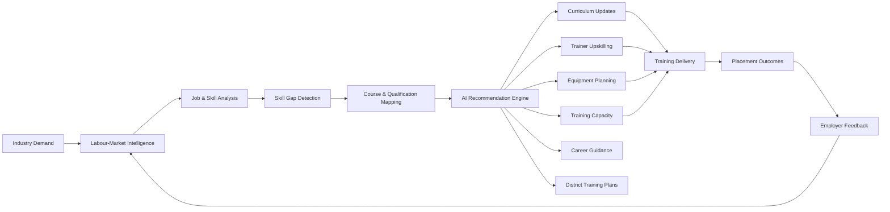
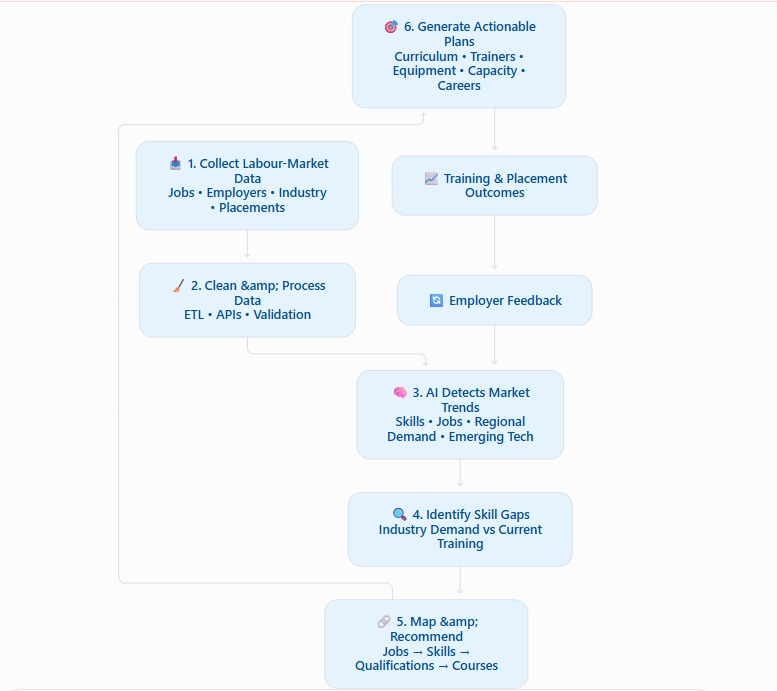
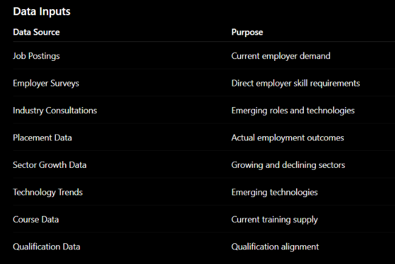
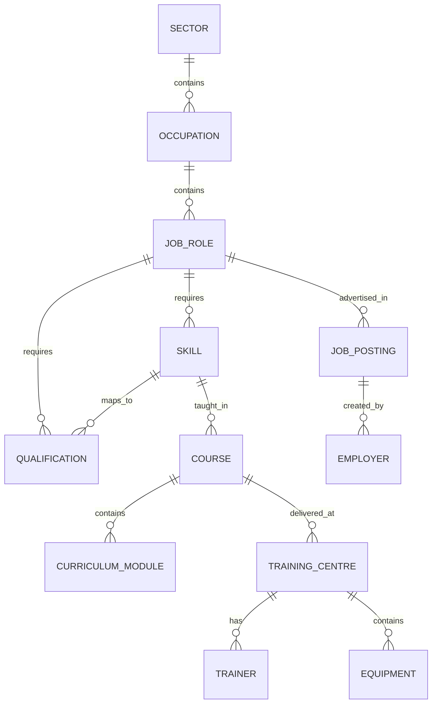

<div align="center">

# 🎯  Labour-Market Intelligence & Curriculum Alignment Platform

### **From Labour-Market Signals → Skills → Curriculum → Training → Employment**

<p>
  
  
  
  
</p>

<p>
  A data-driven platform that connects <strong>industry demand</strong> with
  <strong>skills, qualifications, curricula, training capacity, trainers, infrastructure, and candidate career pathways.</strong>
</p>

<br>

<a href="#-problem-statement">Problem</a> •
<a href="#-our-solution">Solution</a> •
<a href="#-features">Features</a> •
<a href="#️-architecture">Architecture</a> •
<a href="#-dashboards">Dashboards</a> •
<a href="#-ai--analytics">AI & Analytics</a>

</div>

---

## 📑 Table of Contents

<details>
<summary><strong>Click to expand</strong></summary>

- [📌 Problem Statement](#-problem-statement)
- [💡 Our Solution](#-our-solution)
- [🎯 Objectives](#-objectives)
- [🏗️ Architecture](#️-architecture)
- [🚀 Features](#-features)
  
- [🤖 AI & Analytics](#-ai--analytics)
- [🗂️ Data Model](#️-data-model)
- [📈 Dashboards](#-dashboards)
- [🔐 Data Governance](#-data-governance)
- [🎯 Expected Outcomes](#-expected-outcomes)
- [🧩 Technology Stack](#-technology-stack)
- [🏁 Success Definition](#-success-definition)
- [🔮 Future Scope](#-future-scope)

</details>

---

# 📌 Problem Statement

Skill-development programmes are often designed around broad or historical occupation categories that may not adequately reflect the rapidly changing requirements of industries and the job market.

Emerging technologies, evolving job roles, changing productivity standards, regional industry demand, and employer expectations can create a significant gap between:

```text
┌─────────────────────────────────────────────────────────────┐
│                     CURRENT TRAINING                        │
├─────────────────────────────────────────────────────────────┤
│ Skills taught                                               │
│ Course content                                              │
│ Qualifications                                              │
│ Trainer capabilities                                        │
│ Training infrastructure                                     │
└──────────────────────────────┬──────────────────────────────┘
                               │
                               │      MISMATCH
                               ▼
┌─────────────────────────────────────────────────────────────┐
│                    INDUSTRY REQUIREMENTS                    │
├─────────────────────────────────────────────────────────────┤
│ Employer skills                                             │
│ Emerging technologies                                       │
│ Current job roles                                           │
│ Regional opportunities                                      │
│ Productivity expectations                                   │
└─────────────────────────────────────────────────────────────┘
```

# 💡 Our Solution
🧠 AI-Powered Labour-Market Intelligence & Curriculum Alignment Platform

Our platform continuously transforms labour-market signals into actionable recommendations for the skill-development ecosystem.

It connects:

```
  Industry Demand → Skills → Qualifications → Courses → Curriculum → Training Capacity → Trainers →
  Infrastructure → Candidates → Employment Outcomes
```

## 🌐 Solution at a Glance

# 🎯 Objectives

The platform is designed to:

- Reduce mismatch between training and industry requirements.
- Identify emerging skills before they become mainstream requirements.
- Continuously align curricula with employer expectations.
- Identify oversupplied or declining courses.
- Improve training-centre capacity planning.
- Identify trainer competency gaps.
- Improve candidate career guidance.
- Support evidence-based policy and institutional decisions.
- Improve employment and placement outcomes.
- Establish a continuous industry-to-training feedback loop.

# 🏗️ Architecture
<b>High-Level Solution Architecture</b>
</br>
</br>


# 🚀 Features

<details> <summary><strong>1️⃣ Labour-Market Data Intelligence</strong></summary>

<b>The platform collects and analyses multiple labour-market signals.</b>



<b>Example Intelligence Flow</b>
```text
Data
 ↓
Validation
 ↓
Cleaning
 ↓
Normalisation
 ↓
Aggregation
 ↓
Labour-Market Intelligence
```
</details>
<details> <summary><strong>2️⃣ Job Role & Skill Intelligence</strong></summary>

The system analyses job descriptions to identify:

- Job roles
- Technical skills
- Soft skills
- Tools and technologies
- Experience requirements
- Qualification requirements
- Proficiency levels
- Location
- Salary ranges, where available
- Industry / sector
```text
Example
JOB ROLE
Solar PV Technician

    │
    ├── Solar Panel Installation
    ├── Electrical Wiring
    ├── PV System Maintenance
    ├── Electrical Safety
    ├── Testing & Troubleshooting
    └── Digital Documentation

Proficiency → Intermediate
Location    → District / State
Sector      → Renewable Energy
```
</details>
<details> <summary><strong>3️⃣ Skill Demand Analysis</strong></summary>

The platform combines multiple demand signals.

<strong>Conceptual Model</strong>
```text
                 ┌─────────────────────┐
                 │   Job Posting Data  │
                 └──────────┬──────────┘
                            │
                 ┌──────────▼──────────┐
                 │ Employer Validation │
                 └──────────┬──────────┘
                            │
                 ┌──────────▼──────────┐
                 │   Sector Growth     │
                 └──────────┬──────────┘
                            │
                 ┌──────────▼──────────┐
                 │ Technology Signals  │
                 └──────────┬──────────┘
                            │
                            ▼
                  ┌─────────────────┐
                  │ Skill Demand    │
                  │ Intelligence    │
                  └─────────────────┘
```

</details>
<details> <summary><strong>4️⃣ Skill Gap Analysis</strong></summary>

The platform compares industry requirements with current course coverage.

Example
Skill	Industry Demand	Course Coverage	Gap
PLC Programming	High	Medium	🔴 High
Industrial IoT	High	Low	🔴 High
Electrical Safety	High	High	🟢 Low
Basic Wiring	Medium	High	🟢 Low
</details>
<details> <summary><strong>5️⃣ Course & Curriculum Alignment</strong></summary>

The platform maps:
```
Job Role
   ↓
Required Skills
   ↓
Qualification
   ↓
Existing Course
   ↓
Curriculum Modules
```
### Curriculum Intelligence
The system identifies:

- ✅ Skills already covered
- ❌ Missing skills
- ⚠️ Outdated modules
- 🆕 Emerging skills
- 🧪 Required practical training
- 🛠️ Required equipment
- 🧑‍🏫 Required trainer competencies
- Example Recommendation
### 📘 Course
Industrial Automation Technician
```
┌─────────────────────────────────────┐
│ ADD                                 │
│ ✓ PLC Programming                   │
│ ✓ Industrial IoT                    │
│ ✓ Sensor Integration                │
│ ✓ HMI Configuration                 │
├─────────────────────────────────────┤
│ UPDATE                              │
│ ↻ Industrial Networking             │
│ ↻ Troubleshooting                   │
├─────────────────────────────────────┤
│ REVIEW                              │
│ ⚠ Legacy Control Systems            │
├─────────────────────────────────────┤
│ EQUIPMENT                           │
│ → PLC Training Kits                 │
│ → HMI Panels                        │
│ → Industrial Sensors                │
└─────────────────────────────────────┘
```
</details>
<details> <summary><strong>6️⃣ Course Demand & Supply Analysis</strong></summary>

The platform compares labour-market demand against training capacity.
```
Example
LABOUR DEMAND
     │
     ▼
10,000 estimated opportunities
     │
     ▼
TRAINING CAPACITY
     │
     ▼
3,000 available seats
     │
     ▼
⚠️ CAPACITY GAP
```
- Intelligence Generated
- High-demand / low-capacity courses
- High-capacity / low-demand courses
- Emerging occupations
- Capacity expansion opportunities
- Courses requiring additional validation
</details>
<details> <summary><strong>7️⃣ Obsolescence & Oversupply Detection</strong></summary>

Courses may be flagged for review when:

- Relevant job demand consistently declines.
- Employer requirements change substantially.
- Placement outcomes deteriorate.
- Technology changes skill requirements.
- Training capacity exceeds observed demand.
- Employers report low curriculum relevance.
```
Example
📘 Course Health Monitoring

Legacy Manufacturing Technician

Demand Trend           ↓ Declining
Placement Trend        ↓ Declining
Employer Relevance     ↓ Low
Technology Impact      ↑ High

Recommendation
────────────────────────────────────
Review curriculum and assess whether
the programme requires restructuring.
```
The platform should support human review and decision-making, rather than automatically discontinuing programmes.

</details>
<details> <summary><strong>8️⃣ Employer Validation</strong></summary>

Employers can participate directly in validating platform recommendations.

Employers Can
- Identify required skills.
- Validate job roles.
- Review curriculum changes.
- Identify emerging technologies.
- Provide candidate-readiness feedback.
- Report skill gaps.
- Participate in curriculum consultations.
</details>
<details> <summary><strong>9️⃣ Trainer Development</strong></summary>

Curriculum updates may create new trainer competency requirements.
```
Required Trainer Skills
          │
          ▼
   ┌───────────────┐
   │ Skill Mapping │
   └───────┬───────┘
           │
           ▼
Existing Trainer Skills
           │
           ▼
    Competency Gap
```
Example
NEW CURRICULUM
Industrial IoT

Required:
- ✓ PLC
- ✓ Sensors
- ✓ Industrial Networking
- ✗ IoT Platforms

Action:
🧑‍🏫 Trainer Upskilling Recommended
</details>
<details> <summary><strong>🔟 Equipment & Infrastructure Planning</strong></summary>

The platform connects curriculum requirements with physical infrastructure.

This enables evidence-based equipment and infrastructure planning.

</details>
<details> <summary><strong>1️⃣1️⃣ District-Level Training Planning</strong></summary>

The platform provides demand intelligence at district level.

Example
```
📍 District: Example District
HIGH-DEMAND SECTORS
├── Manufacturing
├── Renewable Energy
└── Logistics

HIGH-DEMAND ROLES
├── CNC Operator
├── Solar Technician
└── Warehouse Associate

KEY SKILL GAPS
├── CNC Programming
├── Electrical Diagnostics
└── Warehouse Management Systems

TRAINING CAPACITY
├── Existing Seats       : 1,200
├── Estimated Demand     : 2,000
└── Capacity Gap         :   800
```
This allows authorities to create district-specific training plans instead of relying only on state or national averages.

</details>
<details> <summary><strong>1️⃣2️⃣ Candidate Career Guidance</strong></summary>

Candidates can provide:

- Education
- Existing skills
- Experience
- Location
- Career interests

Example Career Path
```
Electrical Technician
        ↓
Industrial Electrical Technician
        ↓
PLC Technician
        ↓
Industrial Automation Technician
        ↓
Automation Specialist
```
Each stage can show:

- Required skills
- Qualifications
- Courses
- Experience requirements
- Local opportunities
</details>


# 🤖 AI & Analytics
🤖 AI / Analytics

The platform can use AI and analytics to process large volumes of labour-market information.

## 🧠 Natural Language Processing

Potential inputs include:

- Job descriptions
- Employer surveys
- Industry reports
- Course descriptions
- Consultation documents
```text
Raw Text
   ↓
NLP Processing
   ↓
Entity Extraction
   ↓
Skill Extraction
   ↓
Skill Normalisation
   ↓
Skill Taxonomy
```
## 🔗 Semantic Skill Matching

Different terms referring to similar capabilities can be mapped to a common skill.
```text
"Programmable Logic Controller"
              ↓
             "PLC"
              ↓
       COMMON SKILL ID
```
## 📈 Trend Detection

The platform can monitor skill demand over time.
```text
Demand
  │
  │                         ●
  │                    ●
  │               ●
  │          ●
  │     ●
  │ ●
  └──────────────────────────────
      2024   2025   2026
```
## 🆕 Emerging Skill Detection

Emerging technologies and rapidly increasing skills can be identified before they are incorporated into existing training structures.

## 🧠 Intelligence Layers

The core platform can be viewed as five connected intelligence layers:
```text
┌──────────────────────────────────────────┐
│  1. LABOUR-MARKET INTELLIGENCE           │
│  Demand • Trends • Regions • Employers   │
├──────────────────────────────────────────┤
│  2. SKILL INTELLIGENCE                   │
│  Skills • Proficiency • Emerging Skills  │
├──────────────────────────────────────────┤
│  3. CURRICULUM INTELLIGENCE              │
│  Courses • Modules • Gaps • Alignment    │
├──────────────────────────────────────────┤
│  4. TRAINING CAPACITY INTELLIGENCE       │
│  Seats • Trainers • Equipment            │
├──────────────────────────────────────────┤
│  5. CAREER & EMPLOYMENT INTELLIGENCE     │
│  Pathways • Placements • Outcomes        │
└──────────────────────────────────────────┘
```
# 🗂️ Data Model
A simplified data relationship:


# 📈 Dashboards
## 🏛️ Policymaker Dashboard

Provides:

- Sector demand
- District-wise skill demand
- Skill gaps
- Course performance
- Training capacity
- Emerging occupations
- Trainer requirements
- Infrastructure requirements
Example UI
```text
┌─────────────────────────────────────────────────────┐
│ POLICYMAKER OVERVIEW                                │
├───────────────┬───────────────┬─────────────────────┤
│ Skill Demand  │ Capacity Gap  │ Emerging Skills     │
│     82%       │     1,250     │        24           │
├───────────────┴───────────────┴─────────────────────┤
│                                                     │
│ 📍 District Demand Map                              |
│                                                     │
│   Manufacturing ████████████████                    │
│   Logistics     ███████████                         │
│   Renewable     █████████████                       │
│                                                     │
├─────────────────────────────────────────────────────┤
│ Curriculum Alerts     Trainer Gaps     Equipment    │
│      18                    42             27        │
└─────────────────────────────────────────────────────┘
```
## 🏫 Training Institution Dashboard

Provides:

- Course demand
- Curriculum gaps
- Placement trends
- Required equipment
- Trainer competency gaps
- Employer feedback
## 🏢 Employer Dashboard

Provides:

- Talent availability
- Skill availability
- Training partnerships
- Candidate readiness
- Skill-gap reporting
- Curriculum validation
## 🎓 Candidate Dashboard

Provides:

- Current skills
- Skill gaps
- Recommended courses
- Career pathways
- Local job opportunities
- Required qualifications
# 🔐 Data Governance
Because the platform may process employment and candidate information, responsible data governance is essential.

### Principles
- 🔒 Data minimisation
- ✅ Consent where required
- 👥 Role-based access control
- 🔐 Secure data storage
- 🛡️ Encryption
- 📝 Audit logging
- 🕶️ Anonymisation for analytics
- ⏳ Appropriate retention policies
- 🔍 Transparent recommendation methodology

Sensitive candidate information should not be unnecessarily exposed in aggregate dashboards.
# 🎯 Expected Outcomes
## 🏫 For Training Institutions
- Better curriculum alignment
- Improved course planning
- Better equipment utilisation
- Data-driven capacity planning
- Improved trainer development
## 🏢 For Employers
- Better access to relevant candidates
- Reduced skill mismatch
- Improved candidate relevance
- Better collaboration with training institutions
## 🎓 For Candidates
Better career visibility
More relevant course recommendations
Clearer career pathways
Better understanding of required skills
Improved employment opportunities
## 🏛️ For Policymakers
District-level labour-market intelligence
Evidence-based training planning
Identification of emerging occupations
Better resource allocation
Continuous programme relevance monitoring

# 🧩 Technology Stack
## 🎨 Frontend
- React / Next.js
- TypeScript
- Responsive dashboard framework
- ⚙️ Backend
- Python / FastAPI
- Node.js where appropriate
- REST APIs
## 📊 Data & Analytics
- Python
- Pandas
- Scikit-learn
- NLP / LLM processing
- ETL pipelines
- 🗄️ Database
- PostgreSQL
- Elasticsearch / OpenSearch
- Object storage for raw datasets
## 🤖 AI / ML
- NLP-based skill extraction
- Semantic similarity models
- Classification models
- Time-series trend analysis
- Recommendation models
☁️ Infrastructure
Docker
- Cloud infrastructure
- CI/CD
- Monitoring
- Logging
# 🏁 Success Definition
The platform will be considered successful when it establishes a measurable connection between:
```text
WHAT EMPLOYERS NEED
          ↓
LABOUR-MARKET INTELLIGENCE
          ↓
SKILL REQUIREMENTS
          ↓
QUALIFICATION & COURSE MAPPING
          ↓
CURRICULUM ALIGNMENT
          ↓
TRAINER + EQUIPMENT PLANNING
          ↓
TRAINING DELIVERY
          ↓
CANDIDATE PLACEMENT
          ↓
EMPLOYER FEEDBACK
          ↓
CONTINUOUS IMPROVEMENT
```
The Core Operating Model
```
Train for the skills the market needs, in the locations where they are needed, at the proficiency levels employers
require — and continuously update training based on real-world outcomes.
```
# 🔮 Future Scope
Potential future enhancements include:

- 📡 Real-time labour-market monitoring
- 🔮 Predictive workforce-demand forecasting
- 🏛️ Government employment-platform integration
- 💼 Job-portal integration
- 🧩 Industry-specific skill taxonomies
- 🤖 AI-powered curriculum comparison
- 🆕 Automated emerging-occupation detection
- 🪪 Digital skill passports
- 🧠 Candidate skill-assessment engines
- 🤝 Employer-to-training-provider collaboration
- 🗺️ Geographic skill-demand heat maps
- 📐 Workforce-demand simulation
- 🧮 Scenario-based district training planning
